# CS390.51 - Bioinformatics in R

## Final Project 2023 Report

## Konstantinos-Christos Mathioudakis

These are the data we have to analyze:

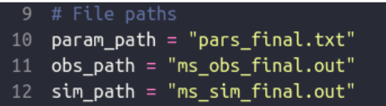

The file “pars_final.txt” contains the parameters that were used to create the simulated datasets
that were created and stored in “ms_sim_final.out”.
The file “ms_obs_final.out” file contains the observed dataset.
First we read the param_data using read.table then we read sim_datasets and obs_dataset
using the function read_datasets.

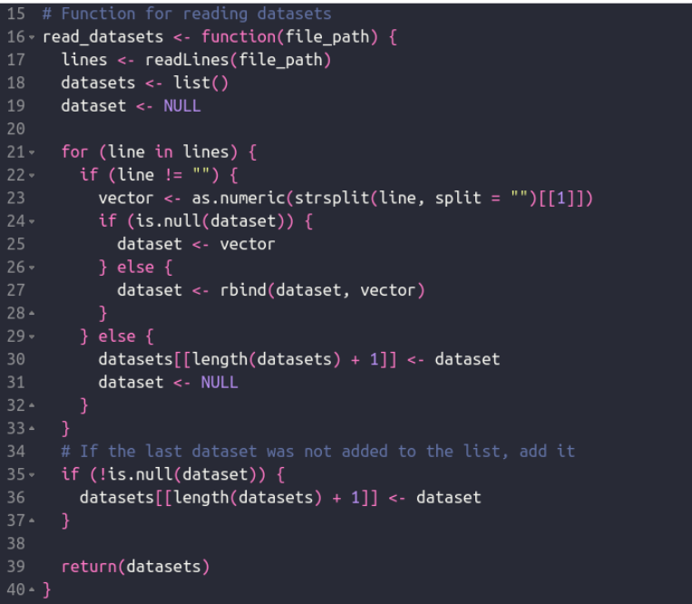

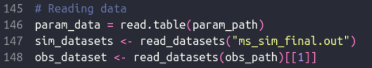

---

### Questions 1 and 2

The next part is calculating the statistics.
First we calculate k which is the average number of pairwise differences and is calculated as
such:

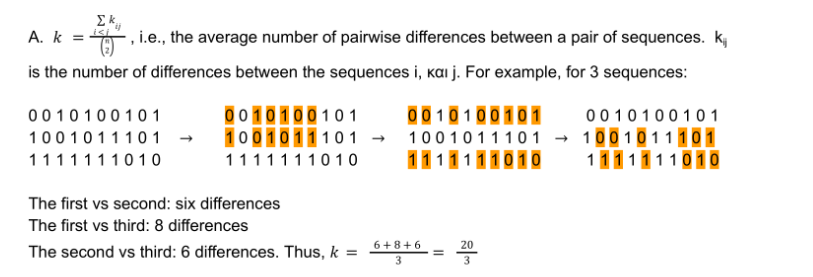

So this is the function for calculating k:

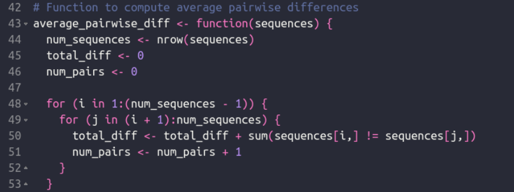

In order to calculate k for the simulated datasets we call the ‘lapply’ function since the
sim_datasets is a list of vectors.

Then we have created the function to calculate w which is calculated as:

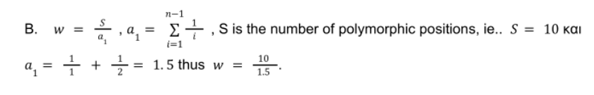

Again for the sim_datasets we call the ‘lapply’ function since it’s a list of vectors.

Next is the calculation for 'Tajima's D':

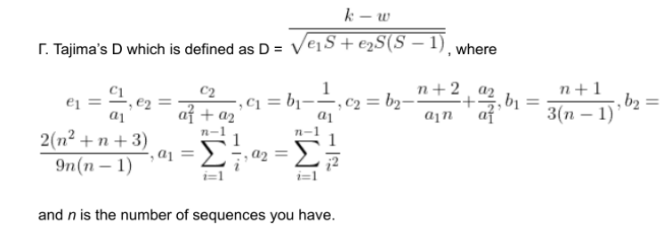

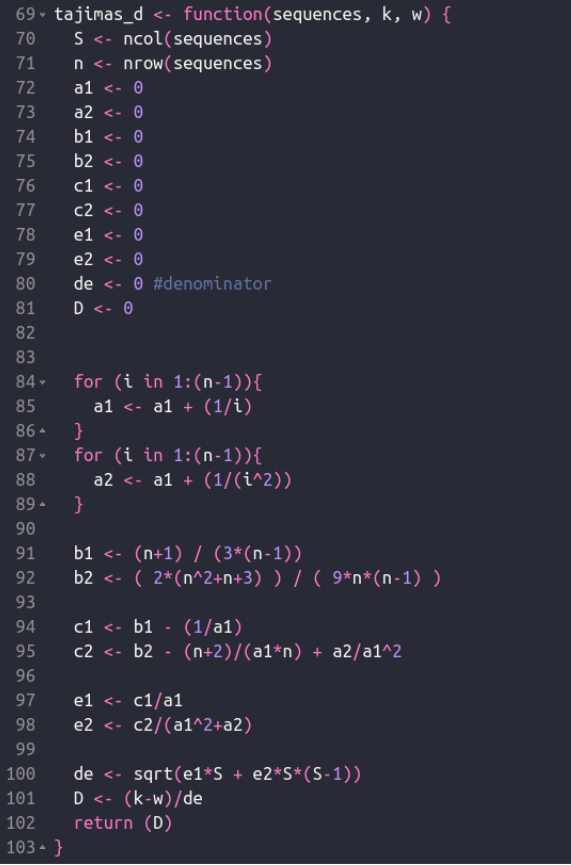

---

### Question 3

Since for the calculation for ‘Tajima’s D’ we need the k,w values too. We need to call the
‘mapply’ function this time instead of ‘lapply’.

The next part is standardization. Since R has pre built functions for standard deviation
calculation and it takes as input a numeric vector we need to first make the sims_k, sims_w,
sims_D numeric since they are lists.

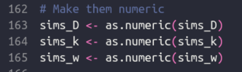

After that we can proceed to standardization using the function ‘standardize’ for the sim vectors
and using the ‘standardize_obs’ function for the obs vectors. For the standardization of the obs
vector we are using the mean and standard deviation calculated from the sim vectors.

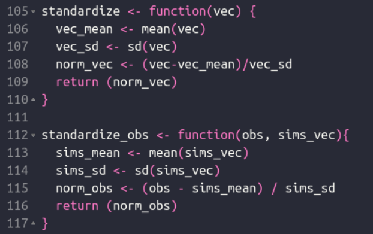

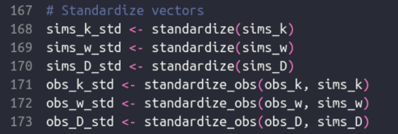

---

### Question 4

We then calculate the euclidean distance using the function below:

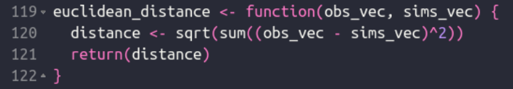

We created the ‘obs_vec’ vector and the ‘sim_vec’ so we can pass them to the function that
calculates the euclidean distance.
Then using R’s built in function ‘sapply’ we iterate over the indices of ‘sims_k_std’, ‘sims_w_std’
and ‘sims_D_std’’. We apply the function to each index and return the result as a vector.
Inside the ‘sapply’ function a vector called ‘sim_vector’ is created to combine the values at the
current index from the ‘sims_k_std’, ‘sims_w_std’ and ‘sims_D_std’ vectors.
Then the function for calculating the euclidean distance is called with ‘obs_vec’ and ‘sims_vec’
(we just created it ) as arguments.
The results are returned by the ‘euclidean_distance’ function and stored in a vector called
‘distances’.

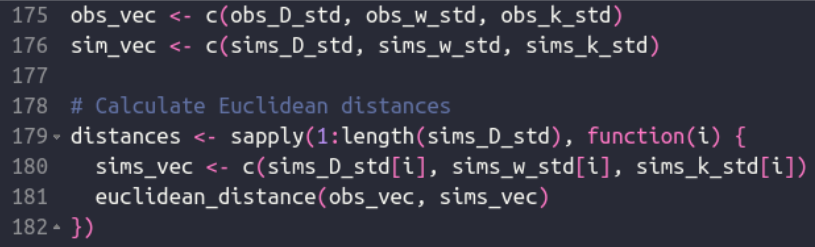

---

### Questions 5-6-7

Next we need to find the 500 smallest distances and take their indexes to find the parameters
that were used to create the simulated datasets.
First we called the order function which orders the ‘distances’ vector and we keep the first 500
indexes then use those indexes to get their parameters from ‘param_data’.
After that we calculate their mean and median.

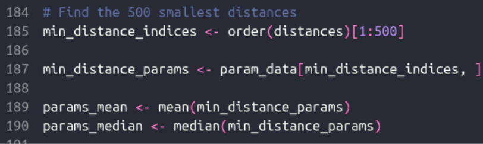

### Question 8

Last but not least we plot the histogram and density plot of the parameters that were used using
the ‘hist’ and ‘plot’ functions:

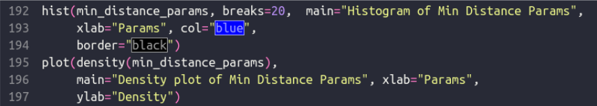

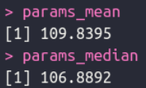

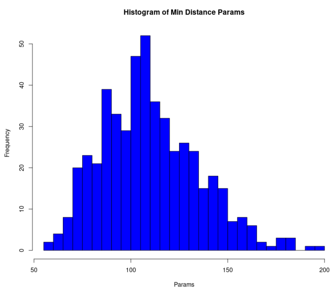

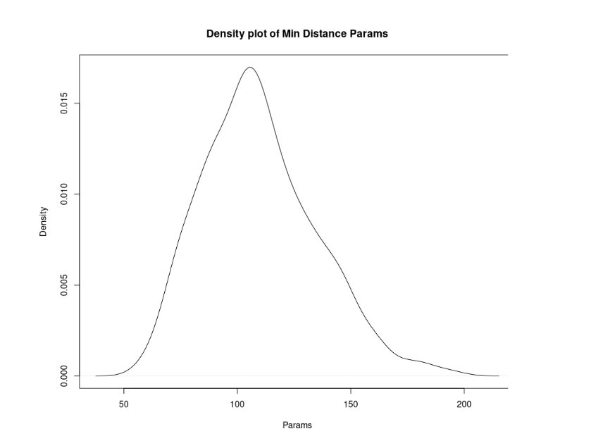

From the density plot we see that there is a big peak around 100-120 with the peak being at
around 110. The peak is sharp, which means that most of the ‘min_distance_param’ data are
close to 109-110 and hence the mean value is representative of those data.
For example suppose these data small datasets:
[1,2,3,4,5,6,7,8,9,10] -> mean = 5.5
[1,5,5.5,6,5.1,5.9,5.4,5.6,5.55,5.45,10] -> mean = 5.5
Both of these datasets have a mean of 5.5 but only in the second dataset most of the data are
close to it.
So in our case we fall in the second category which means that the mean is a good
approximation.

---

### Question 9

We have found that the rate of the exponential growth of COVID-19 in the period of 12 months
in Europe is around 109-110.
The formula for the exponential growth is:

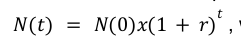

where t is the period N(0) is the initial number of cases and r is the
growth rate (expressed as a fraction).

This means that in a period of 12 months the number of daily cases increased 100 fold, so for
example if on the first day the number of cases was 1.000 then after 12 months the number of
daily cases was around 109.000.
This represents a substantial increase and indicates the disease was spreading rapidly during
the 12 month period.

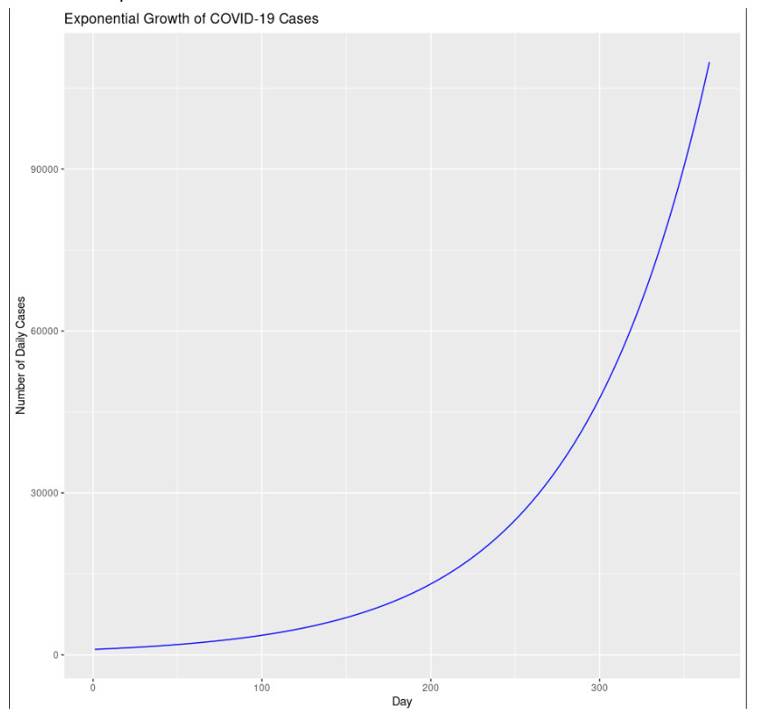
